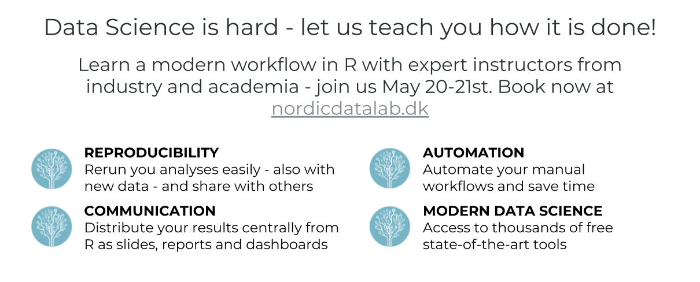

nordicdatalab 
==================================================================================================================================

Officially announcing [www.nordicdatalab.dk](https://nordicdatalab.dk/): Data Science is hard - let us teach you how it is done! Learn a modern workflow in R with expert instructors from industry and academia - join us May 20-21st. Book now at [www.nordicdatalab.dk](https://nordicdatalab.dk/)

About
-----

nordicdatalab offers courses and training in analysis in R (which is industry standard and free). You'll learn to work with data, get insight from and model data, and to communicate these insights effectively. All in a modern workflow, that is being by top researchers and analysts in academia and in industry. The courses are held in Copenhagen, and you're being taught by experts who do research and product development daily using the skills taught. [Click here for more information](https://nordicdatalab.dk/)

nordicdatalab tilbyder kurser og træning i dataanalyse i værktøjet R (der er industristandard og gratis). Du lærer at arbejde med data, få indsigt fra og modellere data, og kommunikere disse indsigter effektivt. Alt dette i et moderne workflow, der bruges af topforskere og dataanalytikere i academia og det private. Kurserne afholdes i København, og du får undervisning af eksperter, der forsker og produktudvikler i R dagligt. [Klik her for mere information](https://nordicdatalab.dk/)
